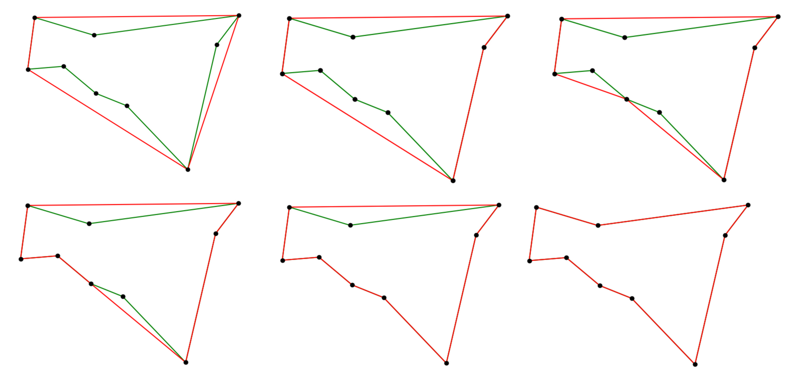

# polygonal-tension-tsp
Original algorithm that takes a geometric approach to approximate solutions to the travelling salesman problem

## Usage
The number of nodes in the graph can be changed at the top of polytension.py. When polytension is run, it generates a random distribution of nodes and then shows the path that the algorithm generated. Every time the window is closed, another graph is created and the algorithm is run agian.

## Algorithm
### Procedure
1. Start with an outer polygon that completely encloses all vertices
2. Until all nodes are connected:
    1. Find the best possible node-edge pair to connect (using scoring method described below)
    2. If the new edges overlap existing edges, ignore that node-edge pair

### Scoring Method
#### Base Score
Amount of 'tension' experienced if one were to stretch an edge inward to a vertex (imagine pulling a rubber band). This score is calculated using the ratio of the new path length to the old path length.
#### Improved Score
Better results were seen when rasing the denominator in the calculation to various powers. This would give shorter edge lengths more weight over longer edge lengths.

### Step-through

In green, the true shortest path is shown. In red, the progress of polytension is shown.

## Dependencies
matplotlib
